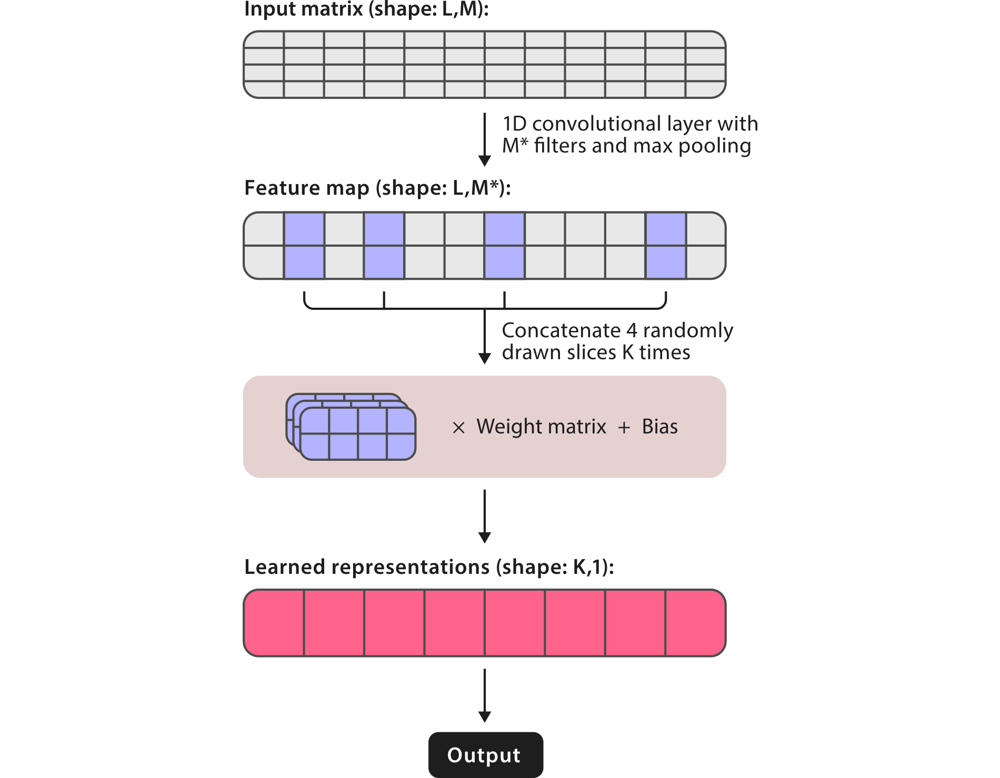

# Theory

## IGLOO sequence representations

Traditionally, recurrent neural networks (RNNs) are the go-to models to create high level representations from sequence data. However, these networks don't perform well with long sequences and their training can be very slow. To achieve better classification performance and speed, RNAsamba uses the recently introduced IGLOO architecture[^1], which looks at sequences as a whole, rather than sequentially like in the recurrent paradigm. To do so, IGLOO creates representations of sequences by taking patches of the feature space and multiplying them by learnable weights. By taking global snapshots of the sequence, IGLOO networks can be used to process very long sequences, making them particularly interesting for nucleotide sequence data.

## Two branch structure

Starting from the initial nucleotide sequence, RNAsamba computes the coding potential of a given transcript by combining information coming from two different sources: the Whole Sequence Branch (B1) and the Longest ORF Branch (B2). B1 contains whole sequence representations of the transcript and can capture protein-coding signatures irrespective of the identification of the ORF. In contrast, B2 carries information extracted from the longest identified ORF and the putative protein translated from it. By taking into account these two sources of sequence information, RNAsamba builds a thorough model of the transcript, improving the classification performance of the algorithm.

For a more detailed description of RNAsamba's algorithm, please check our [article](https://academic.oup.com/nargab/article/2/1/lqz024/5701461).

[^1]: Sourkov, Vsevolod. "IGLOO: Slicing the Features Space to Represent Long Sequences." *arXiv* (2018).